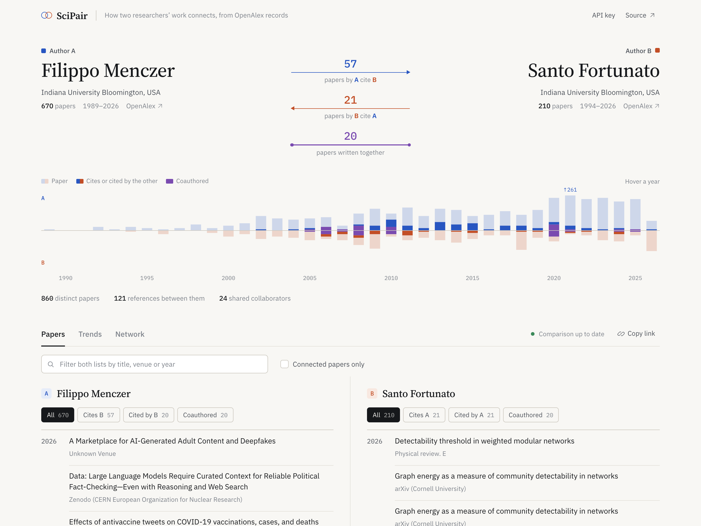

# SciPair

Compare two researchers side by side: who cites whom, what they wrote together, and which collaborators they share. Publication data comes from [OpenAlex](https://openalex.org).

**[scipair.github.io](https://scipair.github.io)**



## What you get

- Citation counts in each direction between the two authors, plus the papers they coauthored. Click a number to list those papers.
- A mirrored timeline of both publication records, with linked and joint papers highlighted.
- Both paper lists, filterable by relationship, title, venue or year.
- Yearly trends and a collaboration network showing shared coauthors.

The URL ends with both OpenAlex author IDs (`#A…;A…`), so you can share a comparison by copying the link.

## Things to know

- OpenAlex sometimes lists a preprint and its published version as separate works, so the same paper can appear more than once.
- Authors with a large number of papers take a few seconds to load. Lists and counts update while loading.
- No API key is needed. If you hit the anonymous rate limit, add a free OpenAlex key under **API key**. The key is kept for the browser session only.

## Development

```bash
npm install
npm start
```

`npm test` runs the tests and `npm run build` makes a production build. Pushes to `main` deploy to GitHub Pages.

Bug reports and pull requests are welcome in [Issues](https://github.com/scipair/scipair/issues).

## Authors

[Danishjeet Singh](https://singhdan.me) and [Filipi N. Silva](https://filipinascimento.github.io).

## License

[Apache 2.0](LICENSE). You can use, modify and redistribute SciPair, provided you keep the copyright and [NOTICE](NOTICE) file and mark files you changed. The license does not grant use of the SciPair name for your own version.
